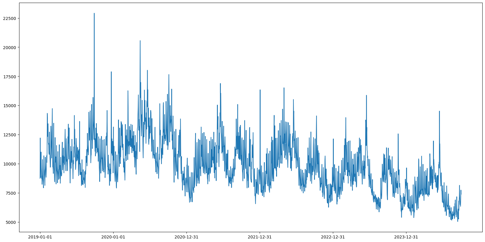

# Usage

## 1. Read CSV

`/res` 폴더에는 브랜드마다 2019년 1월 1일 ~ 2024년 9월 30일까지의 검색량 데이터가 있습니다.

필요한 브랜드의 csv파일을 읽어 데이터프레임으로 변환할 수 있습니다.
또는 여러 개의 csv파일을 읽어 병합할 수도 있습니다.

```python
import pandas as pd

df_라코스테 = pd.read_csv('../res/라코스테.csv') ## Read CSV
df_라코스테.set_index('date', inplace=True) ## index를 날짜로 설정 (선택)
df_라코스테.info() ## 칼럼 정보 출력 (선택)
```

## 2. 트렌드(검색량) 시각화

날짜별 검색량을 아래와 같이 시각화할 수 있습니다.

```python
import matplotlib.pyplot as plt

plt.figure(figsize=(20, 10))
plt.plot(df_라코스테['라코스테_absolute'])
plt.xticks(ticks=range(0, len(df_라코스테), 365))
plt.show()
```



## (참고 예제 코드)

`playground/visualizer.ipynb`를 참고하세요.

<br>

# Info

상대수치(트렌드)를 절대수치로 변환하는 로직은 아래와 같습니다. <br>

## 1. 네이버 트렌드 수치 1당 절대 검색량

네이버 트렌드 수치 1당 절대 검색량을 구합니다.

```
네이버 트렌드 수치 1당 절대 검색량  = 네이버 검색광고의 절대 검색량 / 네이버 트렌드의 상대 검색비율
```

## 2. 절대 검색량 산출

각 일자별 네이버 트렌드 수치에 네이버 트렌드 수치 1당 절대 검색량을 곱해 절대 검색량을 산출합니다.

```
절대 검색량 = 각 일자별 네이버 트렌드 수치 * 네이버 트렌드 수치 1당 절대 검색량
```

<br>
<br>

# How it Works

## 1. Naver Trends Excel 다운로드

1-1. [네이버 트렌드 키워드 검색](https://datalab.naver.com/keyword/trendSearch.naver) 에서 검색어 5개 입력, 기간을 2019.1.1 ~ 2024.10.4로 입력

1-2. '네이버 검색 데이터 조회' Btn 클릭
1-3. 페이지 로드가 완료되고, '다운로드' 버튼이 Clickable 상태가 되면 클릭하여 엑셀 다운로드

## 2. Naver Trends Excel에서 브랜드별 상대값 가져오기

2-1. 엑셀 파일이 모두 다운로드되면 read_excel로 가져오기

2-2. (index: 6) 7행부터 날짜, 브랜드, 날짜, 브랜드 ... 시작되므로, 5개 브랜드멸 상대값 가져오기

2-3. 다운로드된 excel 파일을 삭제

## 3. Column(naver_trends) 생성하기

3-1. 새로운 csv 파일을 `naver_search_data.csv` Write하여, Column을 생성 (naver_trends)
Row: 기간
Column: 상댓값

## 4. (없음)

## 5. Naver 검색광고 플랫폼에서 2024.9 절대 검색량 얻기

5-1. `naver_search_data.csv`에서 키워드별 상대 검색량을 가져옴

5-2. 5개 단위로 (네이버 트렌드에서 함께 검색된 그룹), 분리하고 각 그룹에서 1번째 키워드(브랜드명)에서 `브랜드명`, `2024.09의 검색량 평균`을 산출하여 Length가 5인 `keywords_relative_202409_list`(`List<Obj<브랜드명: 2024.09의 검색량 평균>>`)을 반환

5-2. List 내 요소들을 순회하며, `브랜드명`(key) 를 [키워드 검색 도구](https://manage.searchad.naver.com/customers/1261829/tool/keyword-planner)에서 검색

5-3. 최상단의 `월간검색수` 에서 `PC`, `모바일` 값을 더한 후 30으로 나누어 2024.09의 절대 검색량 평균을 산출, List 내의 2024.09의 상대 검색량 평균을 나눔

```
2024.09의 절대 검색량 평균 / 2024.09의 상대 검색량 평균 = 상대 검색량 1당 절대 검색량
```

## 6. 상대 검색량을 절대 검색량으로 변환

각 그룹 (5개)의 모든 키워들의 절대 검색량을 구한 뒤, 새로운 Column (절대 검색량)에 값 작성

## 7. 반복 (절대 검색량 Column에 값 생성)

그룹별, 브랜드별로 절대 검색량 Column을 생성합니다.
